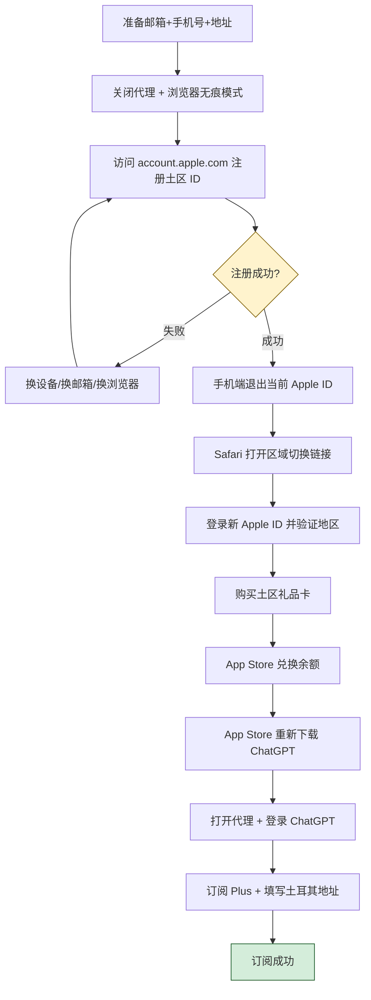
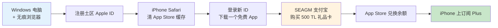

# 土区 Apple ID 注册与 ChatGPT Plus 订阅完整教程

> [!info] 为什么选择土区？
> ChatGPT Plus 在土耳其区的订阅价格为 **499.99 TL**（约合人民币 **78 元**），相比美区 20 美元便宜了一半还多。本教程整合了三篇社区实战经验，覆盖从零开始到成功订阅的完整流程，**全程耗时约 2 小时**。
>
> 比价参考：[appstoreprice.org](https://appstoreprice.org/zh/apps/6448311069)

---

## 一、整体流程速览



---

## 二、准备工作清单

| 物品          | 要求                    | 推荐 / 备注                                                                                                                                          |
| ----------- | --------------------- | ------------------------------------------------------------------------------------------------------------------------------------------------ |
| **邮箱**      | 全新、未注册过 Apple ID      | Gmail、Outlook、163 均有成功案例；**QQ 邮箱不推荐**（容易自动归到国区）                                                                                                  |
| **手机号**     | 中国大陆手机号，区号 `+86`      | 已绑过其它 Apple ID 也可（多人验证）                                                                                                                          |
| **土耳其地址**   | 用于注册和礼品卡付款            | [1K 工具箱地址生成器](https://1ktools.com/zh-cn/tools/developer/turkey-address-generator) 或 [zhenshidizhi.com](https://www.zhenshidizhi.com/?country=TR) |
| **苹果设备**    | iPhone / iPad / Mac   | **付款只能用移动端**，Mac 仅能用于注册账号                                                                                                                        |
| **信用卡**（可选） | 支持外币的 Visa/Mastercard | 招行 Mastercard / Visa 实测可用；走支付宝渠道可不需要                                                                                                             |

> [!tip] 关键提示
> - **关闭系统代理**，使用浏览器无痕模式注册（部分用户挂美国节点也能成功，但稳定起见建议关闭）
> - 出生年月可以随便填，**但要大于 18 岁**
> - 姓名、地址可以直接用生成器的数据，前后保持一致

---

## 三、注册土耳其 Apple ID（推荐使用Windows 电脑注册）

### 步骤 1：访问注册页面

打开浏览器**无痕模式**，访问：

```
https://account.apple.com
```

点击「**创建你的 Apple 账户**」。

### 步骤 2：填写信息

| 字段 | 填写内容 |
| --- | --- |
| 国家或地区 | **土耳其（Türkiye）** |
| 姓名 | 用地址生成器生成的土耳其姓名 |
| 出生日期 | 任意，**需大于 18 岁** |
| 邮箱 | 全新邮箱（非 QQ）|
| 手机号 | 中国大陆手机号，区号 `+86` |

### 步骤 3：完成验证

输入邮箱和短信收到的验证码，注册完成。

> [!warning] 重要提醒
> 注册成功 ≠ 一切就绪。**此时直接登录 App Store 大概率会被送回国区！**
> 必须先做下一章「切换 App Store 区域」的操作。

### 注册失败怎么办？

如果遇到 **「此时无法创建账户」** 提示，多数是 Apple 风控。按以下方法逐一尝试：

> [!example] 实测有效的解决思路
> 1. **换设备**：实测 Mac、iPhone 注册失败 → Windows 电脑注册成功
> 2. **换浏览器 / 切换无痕模式**重试几次
> 3. **换邮箱**重新注册
> 4. **换网络环境**（更换 Wi-Fi 或开关代理）
> 5. **联系 Apple 客服**：可参考 [客服处理教程](https://linux.do/n/topic/465862?sort=old)，但需等待 24 小时生效

---

## 四、切换 App Store 区域（最关键一步）

### 为什么需要这一步？

注册时虽然选了土耳其，但**手机/平板上的 App Store 缓存仍然指向国区**，直接登录会被强制切回国区。必须通过 Safari 中的特殊链接强制清缓存。

### 操作步骤

**1. 先在设备上退出当前 Apple ID**

- **iOS 26+**：设置 → 顶部 Apple 账户 → 媒体与购买项目 → 退出登录
- **Mac**：App Store → 账户菜单 → 退出
- **旧版 iOS**：设置 → iTunes Store 与 App Store → 点击 Apple ID → 注销

**2. 复制下方链接到 Safari 地址栏并回车**

```
itms-apps://itunes.apple.com/WebObjects/MZStore.woa/wa/resetAndRedirect?dsf=143480&cc=tr
```

> [!note] 出现「无法连接 App Store」是正常的
> 这恰恰说明缓存被清除并尝试跳转到了土耳其区，关闭弹窗即可。

**3. 登录新注册的土区 Apple ID**

进入 App Store 后登录，**确认 App Store 内显示为英文/土耳其语**，即代表切换成功。

### 顺手收藏：其它地区切换链接

| 地区           | 快捷跳转链接                                                                                     |
| ------------ | ------------------------------------------------------------------------------------------ |
| 🇺🇸 美国      | `itms-apps://itunes.apple.com/WebObjects/MZStore.woa/wa/resetAndRedirect?dsf=143441&cc=us` |
| 🇯🇵 日本      | `itms-apps://itunes.apple.com/WebObjects/MZStore.woa/wa/resetAndRedirect?dsf=143462&cc=jp` |
| 🇰🇷 韩国      | `itms-apps://itunes.apple.com/WebObjects/MZStore.woa/wa/resetAndRedirect?dsf=143466&cc=kr` |
| 🇭🇰 香港      | `itms-apps://itunes.apple.com/WebObjects/MZStore.woa/wa/resetAndRedirect?dsf=143463&cc=hk` |
| 🇳🇬 尼日利亚    | `itms-apps://itunes.apple.com/WebObjects/MZStore.woa/wa/resetAndRedirect?dsf=143561&cc=ng` |
| 🇹🇷 **土耳其** | `itms-apps://itunes.apple.com/WebObjects/MZStore.woa/wa/resetAndRedirect?dsf=143480&cc=tr` |
| 🇪🇬 埃及      | `itms-apps://itunes.apple.com/WebObjects/MZStore.woa/wa/resetAndRedirect?dsf=143516&cc=eg` |
| 🇮🇳 印度      | `itms-apps://itunes.apple.com/WebObjects/MZStore.woa/wa/resetAndRedirect?dsf=143467&cc=in` |
| 🇦🇷 阿根廷     | `itms-apps://itunes.apple.com/WebObjects/MZStore.woa/wa/resetAndRedirect?dsf=143505&cc=ar` |

> [!tip] 防止"送回国区"小技巧
> 切换地区登录后，**先随便下载一个免费 App 再退出账号**，可以显著降低下次登录被送回国区的概率。

---

## 五、购买土耳其礼品卡

### 三大渠道对比

| 渠道 | 价格区间 | 支付方式 | 黑卡风险 | 推荐指数 |
| --- | --- | --- | --- | --- |
| **SEAGM** | 78~79 元 | **支付宝**、信用卡 | 中等 | ⭐⭐⭐⭐⭐ 无需信用卡，最便捷 |
| **Oyunfor** | 77~80 元（含 2.49% 手续费）| 外币信用卡 | **最低**（土耳其本地老牌平台）| ⭐⭐⭐⭐ 风险最低 |
| **闲鱼** | 79~82 元 | 支付宝 | **最高**（看商家信誉）| ⭐⭐⭐ 不想折腾可选 |

> [!warning] 关于"黑卡"风险
> 没有任何渠道能 100% 保证无黑卡（除非在土耳其本地实体购买）。**建议先充值小额（如 30~50 TL）测试**，没问题再充值 500 TL 用于订阅。

### 渠道一：SEAGM（推荐新手）

**官网**：<https://www.seagm.com/zh-cn/>

**优势**：
- 国内可直接访问，**无需梯子**
- 支持**支付宝**付款，免去办卡烦恼
- 价格稳定，操作友好

**流程**：
1. 注册账号并登录
2. 搜索「**iTunes 礼品卡 (土耳其)**」或「土区 500 TL」
3. 选择 500 TL 面额，使用支付宝支付
4. 在订单页面查看卡密

### 渠道二：Oyunfor（黑卡风险最低）

**官网**：<https://www.oyunfor.com>

**注意事项**：
- 邮箱**不能用 163/126**，建议 Gmail
- 国内手机号可注册
- 仅支持信用卡或本地支付（实测**招行 Visa** 可用）
- 会收取 **2.49% 手续费**

**实测消费**：500 TL 礼品卡 ≈ 77.66 元

### 渠道三：闲鱼

**适合人群**：完全不想折腾、能接受一定风险的用户

**建议**：
- 选择**销量高、评价好**的店铺
- 尽量找有售后保障的卖家
- 仍然推荐先小额测试

---

## 六、兑换礼品卡 + 订阅 Plus

### 步骤 1：兑换余额

1. 打开 **App Store** → 头像 → **兑换充值码或礼品卡**（Redeem Gift Card）
2. 输入卡密 → 兑换成功后余额会显示充值金额

> [!tip] 求稳建议
> 新注册的 Apple ID 较容易被风控。可以**先养几天**再充值，或**先充值小额测试**没问题后再充 500 TL。

### 步骤 2：下载 ChatGPT App

1. 在 App Store **重新下载** ChatGPT 应用
2. **此时打开代理**（注册和充值时建议关代理，但订阅 Plus 需要科学上网）
3. 登录你的 ChatGPT 账号

> [!important] 强绑定提醒
> 每个 Apple ID **强绑定一个 ChatGPT 账号**。建议提前规划好哪个 ChatGPT 账号要订阅 Plus，避免后续混乱。

### 步骤 3：订阅 Plus

1. ChatGPT App 内进入升级订阅页面
2. 确认 Plus 价格显示为 **500 TL**（这是验证地区是否正确的关键）
3. 点击订阅，**必须使用移动设备**（iPhone / iPad），Mac 无法完成支付
4. 弹出账户信息未验证 → 选择「继续」
5. 填写土耳其地址（用第二步生成的那份）→ 电话可填**国内号码**
6. 完成支付，订阅成功！

---

## 七、常见踩坑 FAQ

> [!question] Q1：注册时反复提示「无法创建账户」
> 90% 是 Apple 风控。优先尝试：**换 Windows 电脑** > 换浏览器/无痕 > 换邮箱 > 联系客服（等 24h）。

> [!question] Q2：登录 App Store 后又自动跳回国区
> 没做"切换 App Store 区域"那一步，或没用 **Safari** 打开链接。重做第四章。

> [!question] Q3：订阅时 Plus 价格显示美元/人民币
> 说明 App Store 地区没切对，重新执行清缓存链接并重新登录。

> [!question] Q4：Mac 上点了订阅没反应
> 这是 Apple 的限制：**ChatGPT Plus 订阅只能在 iPhone/iPad 上完成支付**。Mac 仅能用于注册账号。

> [!question] Q5：地址填什么？电话填什么？
> 地址用[生成器](https://1ktools.com/zh-cn/tools/developer/turkey-address-generator)生成的整套土耳其地址；**电话填国内手机号即可**（实测无需验证）。

> [!question] Q6：会不会被封号？
> 风险存在但不高。降低风险的做法：
> - 注册后**养号几天**再充值
> - 充值**小额测试**再大额
> - 不要频繁切换地区

---

## 八、最优路径推荐

如果只想用最快的方式跑通流程，按以下路径走：



**核心要点回顾**：

1. **Windows 注册成功率最高** —— Mac/iPhone 易被风控
2. **必须用 Safari 清 App Store 缓存** —— 否则一切白搭
3. **SEAGM + 支付宝** 是最便捷的礼品卡渠道
4. **付款必须用移动设备** —— Mac 不行
5. **新号建议先养几天**，小额测试再大额充值

---

## 九、参考资料

本教程整合自以下三篇社区实战经验，感谢原作者：

- [[Clippings/土区 Apple ID 注册及充值 GPT Plus 全流程和踩坑攻略(Apple Id注册失败，礼品卡购买)]] —— by loveydfforeve
- [[Clippings/土区充值gpt plus全流程梳理（apple礼品卡充值）]] —— by shuaitangtang
- [[Clippings/【外区apple ID注册指南】以土区为例]] —— by JackZhai

**实用工具汇总**：

- 比价网站：<https://appstoreprice.org/zh/apps/6448311069>
- 土耳其地址生成器：<https://1ktools.com/zh-cn/tools/developer/turkey-address-generator>
- 备用地址生成：<https://www.zhenshidizhi.com/?country=TR>
- 礼品卡（SEAGM）：<https://www.seagm.com/zh-cn/>
- 礼品卡（Oyunfor）：<https://www.oyunfor.com>
- Apple 账户：<https://account.apple.com>

---

> [!success] 教程到这里就结束了
> 整个流程虽然步骤不少，但每一步都不复杂。最容易踩坑的三处已经在文中重点标注：**注册风控** → **缓存清除** → **礼品卡渠道**。按教程顺序操作，2 小时内基本能搞定。祝你订阅顺利！🎉
